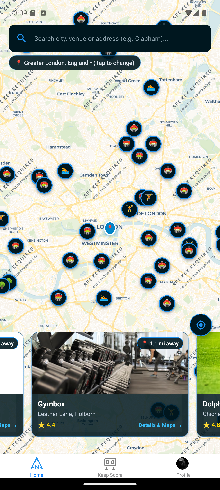
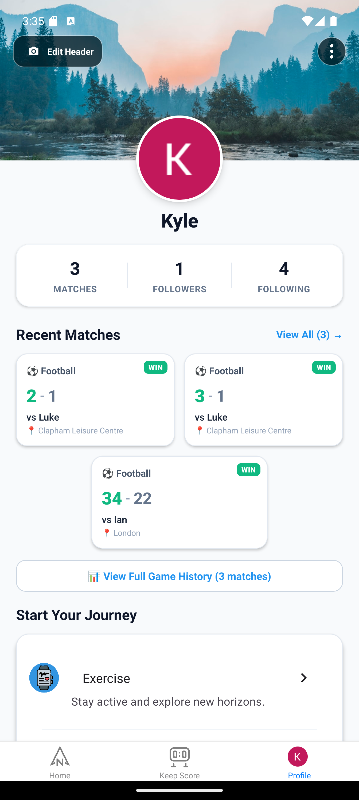
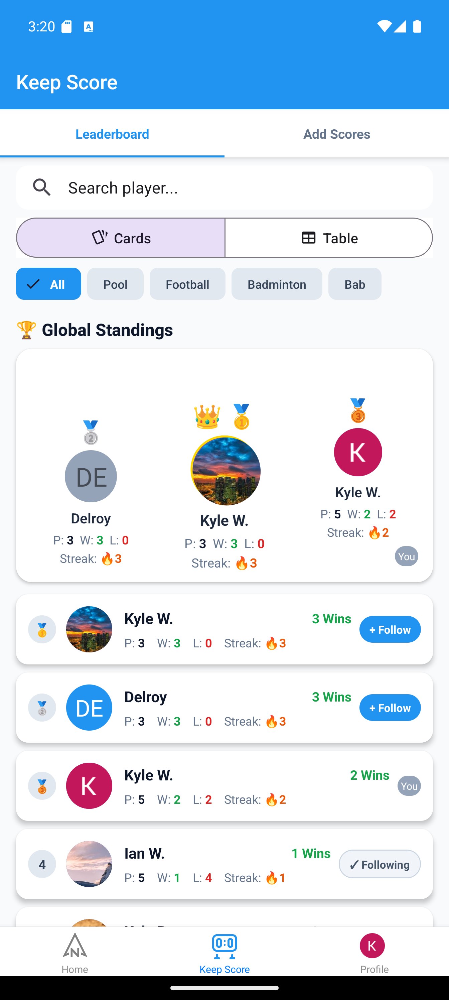
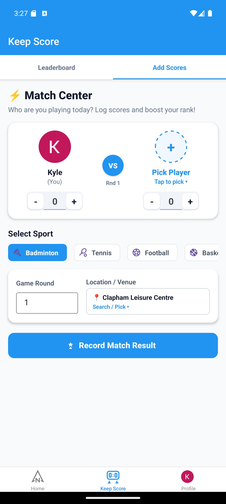

<div align="center">

  

  # KeepingScores 🏆

  **Empowering adults 50+ to stay active, connected, and healthy through community sports.**

  [](https://reactnative.dev/)
  [](https://expo.dev/)
  [](https://supabase.com/)
  [](LICENSE)

</div>

---

## 🌟 The Mission: Tackling Isolation & Promoting Fitness for Adults 50+

As we age, maintaining physical health and a vibrant social circle becomes crucial for well-being. Studies consistently show that **social isolation** and **physical inactivity** are two of the greatest health risks facing adults aged 50 and older.

**KeepingScores** was created to bridge this gap:
- 🤝 **Tackles Loneliness & Isolation**: Connects players with local peers who share an interest in sports and friendly competition.
- 🏃 **Encourages Physical Activity**: Makes finding community leisure centres, public courts, and walking groups effortless.
- 🎯 **Celebrates Milestones**: Promotes positive reinforcement through match tracking, friendly leaderboards, and personal progress celebrations without intimidating competitive pressure.

---

## 📱 Visual Showcase

<div align="center">
  <table>
    <tr>
      <td align="center" width="25%">
        <b>📍 Explore Local Venues</b><br/><br/>
        <a href="./assets/screenshots/01_map_explore.png">
          
        </a>
      </td>
      <td align="center" width="25%">
        <b>👤 Profile & History</b><br/><br/>
        <a href="./assets/screenshots/02_user_profile_screen.png">
          
        </a>
      </td>
      <td align="center" width="25%">
        <b>🏆 Global Standings</b><br/><br/>
        <a href="./assets/screenshots/03_leaderboard.png">
          
        </a>
      </td>
      <td align="center" width="25%">
        <b>⚡ Match Center</b><br/><br/>
        <a href="./assets/screenshots/04_match_center.png">
          
        </a>
      </td>
    </tr>
  </table>
</div>

---

## ✨ Key Features

### 📍 Interactive Venue & Activity Discovery
- Live interactive map displaying nearby leisure centres, parks, gyms, and sports facilities across London.
- Real-time location search (e.g., *Clapham*, *Balham*, *Mitcham*, *Harrow*) with automatic GPS distance calculation.
- Quick venue details and one-tap directions.

### ⚡ Accessible Match Center & Score Tracker
- Intuitive, high-contrast score entry designed specifically for ease of use.
- Large plus/minus steppers for effortless tallying.
- Supports popular sports: **Badminton**, **Tennis**, **Football / Walking Football**, **Basketball**, **Table Tennis**, and more.
- Pick opponents from followed friends or community players.

### 🏆 Global Standings & Social Connections
- Top 3 podium showcasing match activity (`P:`), wins (`W:`), losses (`L:`), and win streaks (`Streak:`).
- Filter standings by sport or view overall standings across all activities.
- Follow community players to stay updated with their matches and friendly rivalries.
- Individual user profile tracking ensuring distinct identities even when players share the same first name.

### 👤 Personal Profiles & Activity History
- Detailed match history with win/loss badges and venue tags.
- Follower and following network counts.
- Customizable profile avatar and banner photos.
- Dedicated account settings with secure one-tap log out.

---

## 🛠️ Tech Stack

- **Frontend**: React Native, Expo (SDK 49)
- **UI Framework**: React Native Paper, React Native Vector Icons
- **Navigation**: React Navigation (Bottom Tabs, Material Top Tabs, Native Stack)
- **Maps & Geolocation**: React Native Maps, Expo Location, OpenStreetMap / Photon Geocoding API
- **Backend & Database**: Supabase (PostgreSQL, Realtime, Database Triggers)
- **Authentication**: Supabase Auth (Google OAuth 2.0 & Email/Password)
- **Storage**: Supabase Storage Buckets for profile avatars and header banners

---

## 🚀 Getting Started: How to Open & Run the Project

### 1. Prerequisites

Make sure you have the following installed on your computer:
- [Node.js](https://nodejs.org/) (version 18 or 20 recommended)
- [Git](https://git-scm.com/)
- [Expo Go app](https://expo.dev/client) installed on your physical iOS or Android smartphone (optional, for physical testing)
- Alternatively, [Android Studio](https://developer.android.com/studio) (Android Emulator) or Xcode (macOS only, iOS Simulator).

---

### 2. Installation

1. **Clone the repository**:
   ```bash
   git clone https://github.com/Kylew-95/KeepingScores.git
   cd KeepingScores
   ```

2. **Install project dependencies**:
   ```bash
   npm install
   ```

---

### 3. Configure Environment Variables

Create a `.env` file in the root directory (or ensure your Supabase configuration is linked in `SupabaseConfig/SupabaseClient.js`):

```env
EXPO_PUBLIC_SUPABASE_URL=your_supabase_project_url
EXPO_PUBLIC_SUPABASE_ANON_KEY=your_supabase_anon_key
```

---

### 4. Running the Application

Start the Expo development server:

```bash
npm start
```
*(or `npx expo start`)*

Once the development server starts, you will see a QR code in your terminal and Metro DevTools:

- **On a Physical Device**:
  - Open **Expo Go** on Android and scan the QR code.
  - On iOS, open the **Camera** app and scan the QR code to open in Expo Go.
- **On Android Emulator**:
  - Press <kbd>a</kbd> in your terminal to launch on the running Android Virtual Device.
- **On iOS Simulator** *(macOS only)*:
  - Press <kbd>i</kbd> in your terminal.
- **On Web Browser**:
  - Press <kbd>w</kbd> in your terminal.

---

## 👴 Older Adults (50+) Usability & Accessibility Highlights

- **Readable Typography**: Large, clear font sizing throughout with high contrast text against clean backgrounds.
- **Generous Touch Targets**: All interactive elements (buttons, chips, steppers, and avatars) maintain a minimum target area of 44×44 points for comfort.
- **Simplified Flows**: Clean 3-tab layout (`Home`, `Keep Score`, `Profile`) avoids deep nesting and confusion.
- **Encouraging Feedback**: Focuses on fun, community participation, and active living rather than high-stress competition.

---

## 📄 License

This project is licensed under the MIT License.
